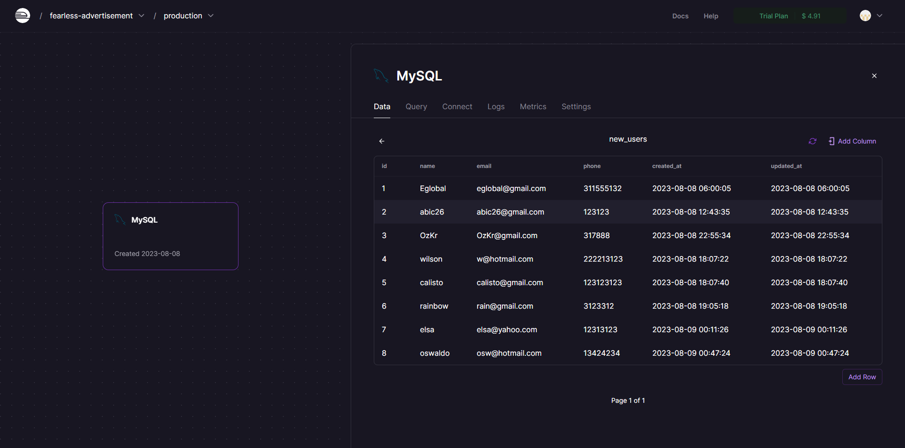

# Proyecto Monograph Dashboard

Proyecto backend para gestionar y visualizar los datos que se envian a la base de datos que se creo para poder utilizar los metodos "GET", "POST" para [Monograph_Dashboard](https://prueba-tecnica-eglobal.vercel.app/#/) mediante el sistema de inicio de sesión. Este proyecto brinda acceso a los usuarios para explorar, crear los datos de la base de datos del proyecto.

Visita el proyecto:
[Backend_Monograph_Dashboard](https://github.com/Abic26/Back_Eglobal_Monograph_Dashboard.git)


## Tabla de Contenidos

- [Instalación](#instalación)
- [Uso](#uso)
- [Despliegue](#despliegue)
- [Postman](#postman)
- [Contribución](#Contribución)
- [Créditos](#créditos)
- [Licencia](#licencia)
- [Contacto](#contacto)

## Instalación

Sigue estos pasos para instalar y ejecutar la aplicación:

1. Clonar el proyecto 
```sh
git clone https://github.com/Abic26/Back_Eglobal_Monograph_Dashboard.git
```
2. Seleccione donde descargo el proyecto:
```sh
cd ejemplo/ejemplo
```
3. Instala las dependencias:
```sh
composer update
```
4. Abrir el proyecto en el editor de código de preferencia, se recomienda Vsc (Visual Studio Code):
```sh
code .
```
5. inicializa el proyecto en local
```sh
php artisan serve
```
## Uso

1. Inicialice el proyecto como se indico anteriormente en [Monograph_Dashboard](https://prueba-tecnica-eglobal.vercel.app/#/) y siga los pasos que se utilizan para iniciar sesión o lea el readme del proyecto Monograoh_Dashboar:

```sh
https://github.com/Abic26/Prueba_Tecnica_Eglobal/blob/main/README.md
```

2. luego ingresaras al login para validar sus credenciales e ingresar a la tabla "Table Users Backend / Lavarel".


Credenciales login
Usuario
```sh
Eglobal
```
Password
```sh
Eglobal
```


3. Ingresaras a la tabla de datos donde podrá observar e interactuar con los datos de la base de datos (MySQL)


4. podrás crear nuevos datos con esta tabla e ingresar nuevos usuarios.

### Crear

Haz click en el botón de New User y complete los campos obligatorios:


## Despliegue

Para el proyecto se desplego por medio de Railway.app, donde se alojo el servidor backend y la base de datos para su uso. 

### MySQL (DATA BASE)
Podra observar los datos creados de prueba y visualizarlos en la tabla "Table Users Backend / Lavarel"


## Postman
Archivo Postmas donde explica el metodo http o las solicitudes que se generaron para este proyecto, en este caso se utilizo "GET", "POST", para crear y ver los datos que se van ingresando y actualizando en tiempo real
[Postman_Api_Eglobal](public/img_Readme/api-Eglobal.postman_collection.json)


## Contribución

Cómo contribuir al proyecto.
1. Clonar el proyecto:
```sh
git clone https://github.com/Abic26/Back_Eglobal_Monograph_Dashboard.git
```
2. Crea una rama para la contribución: 
```sh
git checkout -b feature/nueva-funcionalidad
```
3. Realice sus cambios y realiza los commits: 
```sh
git add .
git commit -m "Agrega nueva funcionalidad"
```
4. Realize push con sus nuevos cambios: 
```sh
git push origin feature/nueva-funcionalidad
```

## Créditos

Este proyecto fue creado por [Andres Felipe Lopez S. "Abic26"](https://github.com/Abic26).

## Licencia

Este proyecto está bajo la Licencia MIT, lo que significa que puedes:

- Usar el código en tus proyectos personales o comerciales.
- Modificar el código para satisfacer tus necesidades.
- Distribuir el código modificado o sin modificar.
- Incluir el código en otros proyectos (con los atributos adecuados).

**¡No tienes que pedir permiso!** Solo asegúrate de incluir el aviso de derechos de autor y la declaración de la Licencia MIT en las copias de tu proyecto.

## Contacto

Si tienes preguntas, sugerencias o comentarios sobre este proyecto, no dudes en ponerte en contacto. Puedes visitarme a través de:

- Correo electrónico: [abicsupa@gmail.com](mailto:abicsupa@gmail.com)
- Sitio web: [Abic26_github_page](https://abic26.github.io/Cv_Andres_Lopez/)

¡Espero escuchar tus pensamientos y opiniones!


